# bamazon

In this activity, you'll be creating an Amazon-like storefront with the MySQL skills. The app will take in orders from customers and deplete stock from the store's inventory. As a bonus task, you can program your app to track product sales across your store's departments and then provide a summary of the highest-grossing departments in the store.

## Technology Used
* Node.js
* npm-cli-table
* npm-inquirer
* npm-MySQL

## Screenshots of Challenge #1: Customer View (Minimum Requirement)

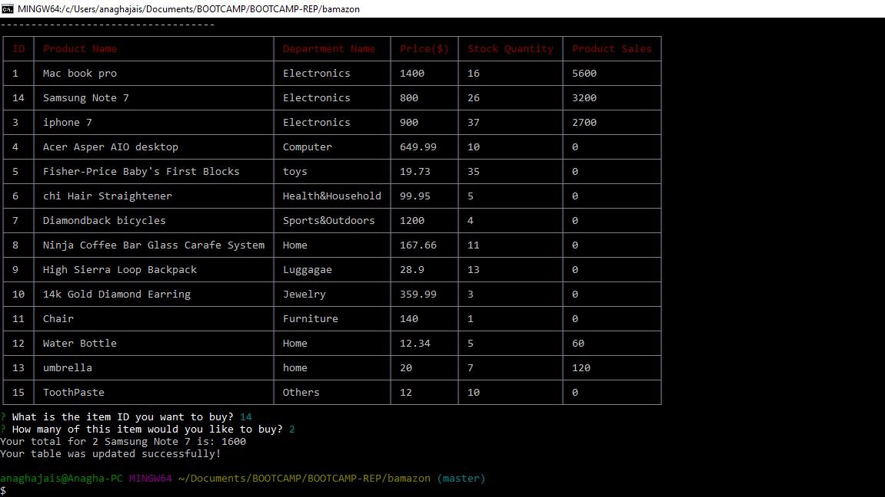

## Screenshots of Challenge #2: Manager View (Next Level)

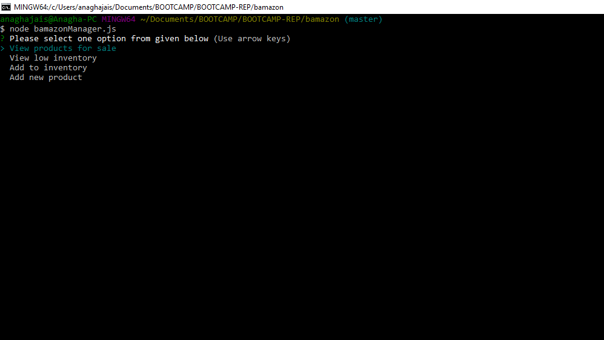

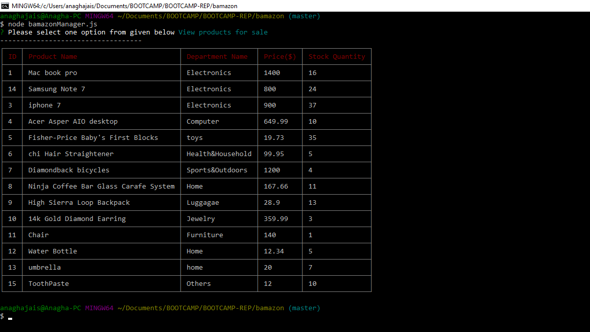

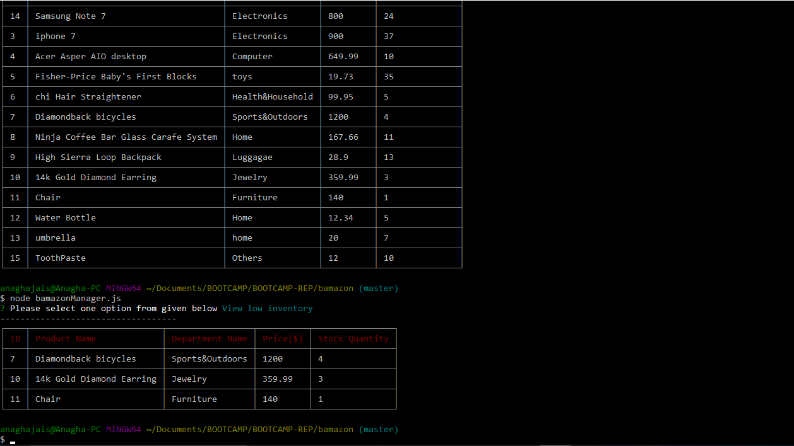

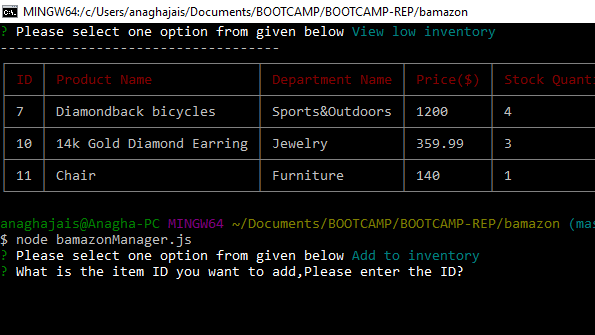

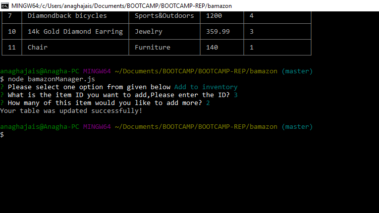

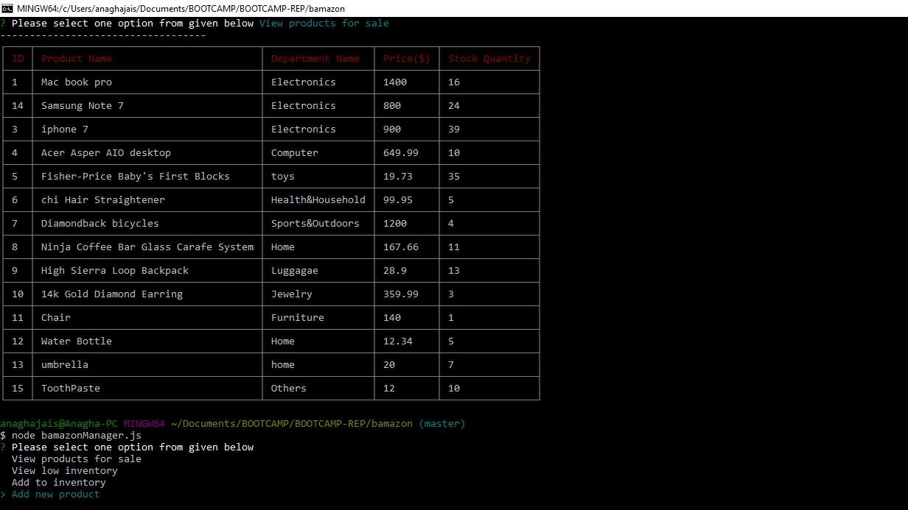

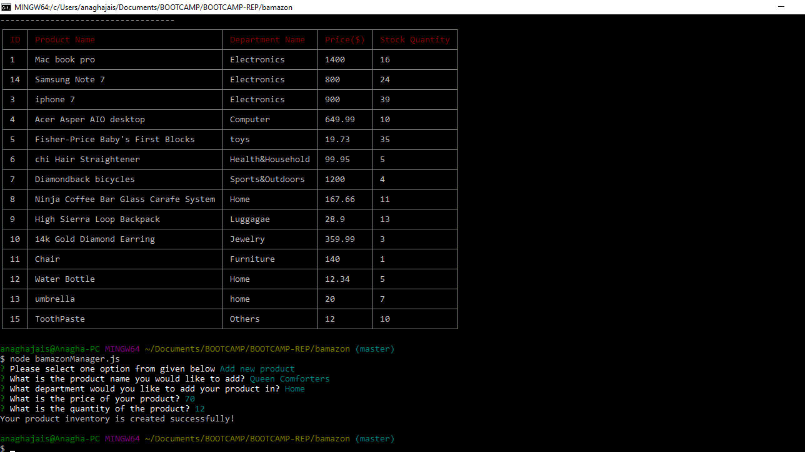

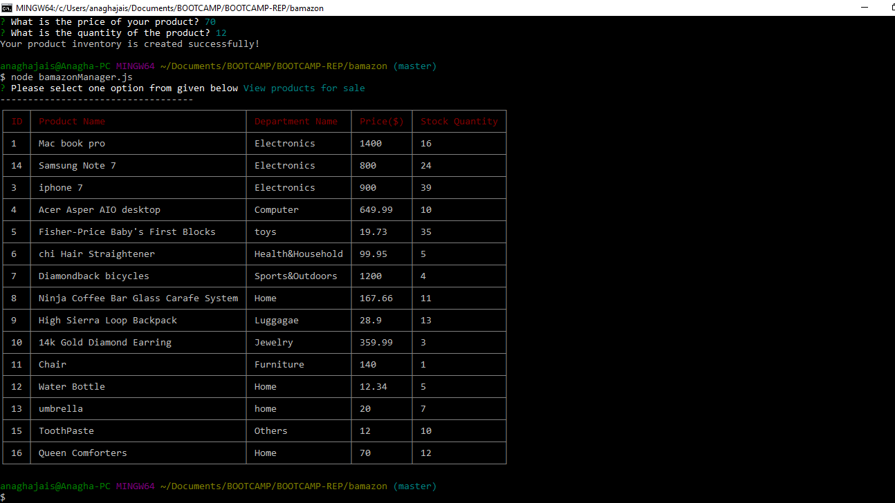

## Screenshots of Challenge #3: Supervisor View (Final Level)

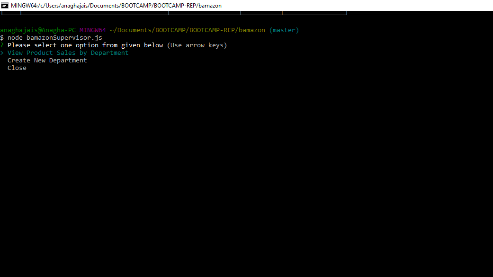

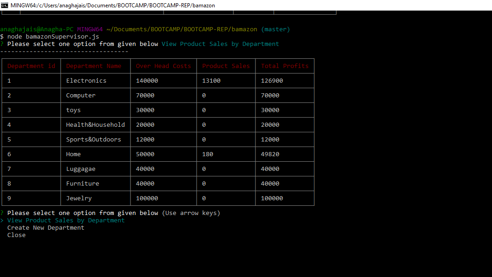

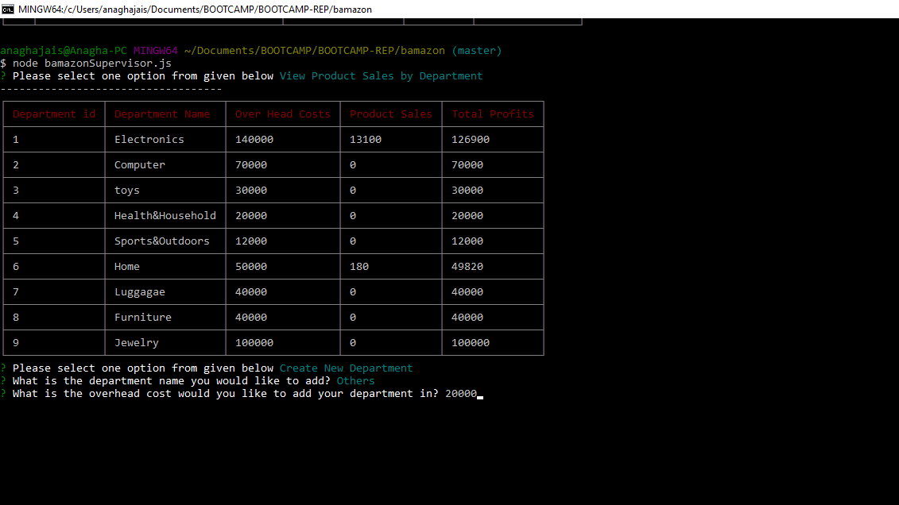

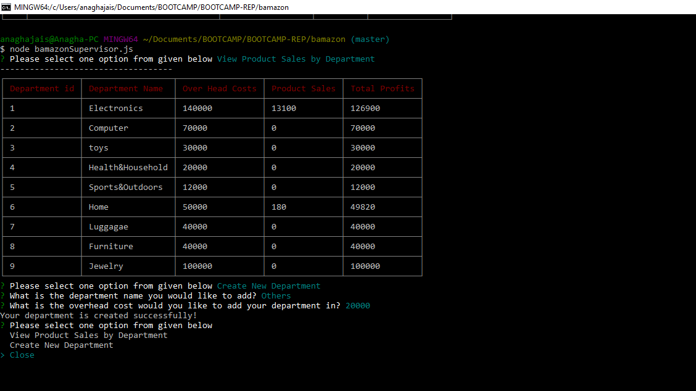

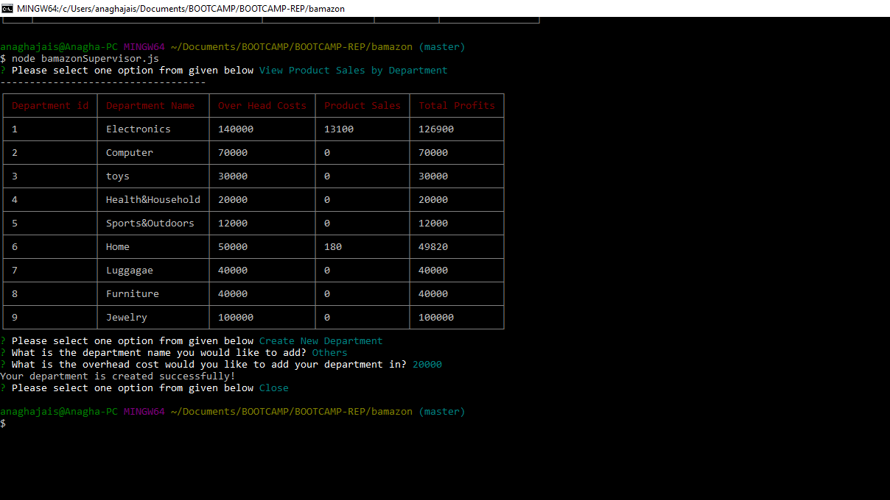

